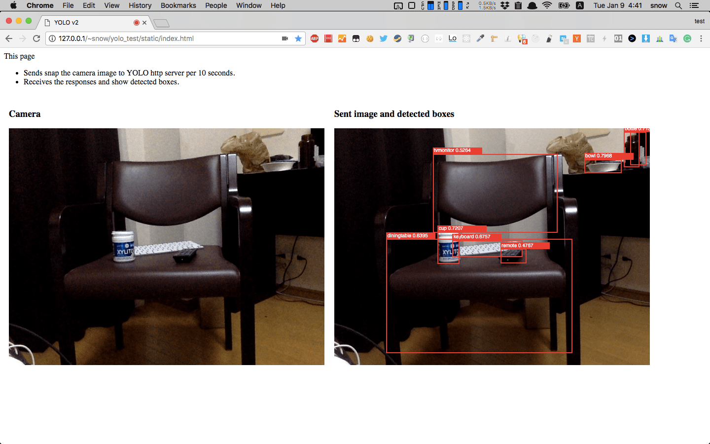

# YOLO v2 HTTP Server

This is a demo code that uses YOLO v2(YAD2K) from the browser with camera.



## Supported environments

- OS: OSX high sierra
- Python: 3.6.2

## Installation

```bash
git submodule update --init --recursive # for YAD2K submodule
pip install -r requirements.txt
```

`cd YAD2K` then follow [QuickStart in README.md of YAD2K](https://github.com/allanzelener/YAD2K/tree/a42c760ef868bc115e596b56863dc25624d2e756#quick-start)

## Run server

```bash
python server.py YAD2K/model_data/yolo.h5 --port 8000
```

### Test from console

```bash
python post_test.py -f YAD2K/images/dog.jpg --port 8000
# output is b'[{"class": "dog", "box": [214.2467498779297, 137.00039672851562, 539.9982299804688, 322.81658935546875], "score": 0.7794011831283569}, {"class": "truck", "box": [81.84661865234375, 461.62774658203125, 167.50804138183594, 694.0625], "score": 0.7995651960372925}, {"class": "bicycle", "box": [112.26277923583984, 80.73719787597656, 468.755859375, 554.430908203125], "score": 0.8415976166725159}]'
```

### Test from browser

- Place `static/index.html` on any web server and open the page by browser.

## Lint

```bash
flake8 server.py
mypy server.py
```
